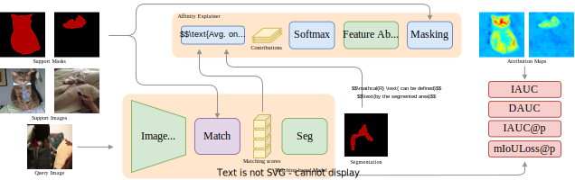

#  [AffinityExplainer](https://pasqualedem.github.io/AffinityExplainer/)

<div align="center">



*Few-Shot Semantic Segmentation meets Explainability*

[](https://pasqualedem.github.io/AffinityExplainer/)
[](https://arxiv.org)
[](#one-line-demo)
[](LICENSE)

[Installation](#installation) • [Quick Start](#one-line-demo) • [Datasets](#datasets) • [Reproduction](#reproduce-results) • [Examples](#examples)

</div>

---

## Overview

**AffinityExplainer** is a comprehensive framework designed to interpret matching-based few-shot semantic segmentation models. By extracting and visualizing pixel-level contributions from support images, AffinityExplainer reveals how these models make predictions, providing unprecedented transparency into their decision-making process.

This repository accompanies our paper:

> **"Matching-Based Few-Shot Semantic Segmentation Models Are Interpretable by Design"**

### Key Features

- 🔍 **Pixel-Level Attribution**: Extract the contribution of each support pixel to final predictions
- 📊 **Interactive Visualizations**: Comprehensive tools for analyzing model behavior
- ⚡ **One-Line Deployment**: Run demos instantly with minimal setup
- 🎯 **Reproducible Research**: Complete scripts for all paper experiments

---

## One-Line Demo

Experience AffinityExplainer instantly without any installation:

```bash
uvx --from https://github.com/pasqualedem/AffinityExplainer app
```

> **💡 Requirements**: Only [uv](https://docs.astral.sh/uv/) is needed to run this command

This launches an interactive web application where you can explore the interpretability capabilities of matching-based few-shot segmentation models.

You can also run the demo locally after [installation](#installation):

```bash
streamlit run affex/app.py
```

---

## Installation

We use [uv](https://docs.astral.sh/uv/) for fast and reliable dependency management.

### Prerequisites

Ensure you have `uv` installed:

```bash
curl -LsSf https://astral.sh/uv/install.sh | sh
```

### Setup Environment

Clone the repository and install dependencies:

```bash
git clone https://github.com/pasqualedem/AffinityExplainer.git
cd AffinityExplainer
uv sync
source .venv/bin/activate
```

---

## Datasets

AffinityExplainer supports PASCAL VOC12 and COCO datasets for few-shot semantic segmentation experiments.

### Download PASCAL VOC12

```bash
bash scripts/download_pascal.sh
```

### Download COCO

```bash
bash scripts/download_coco.sh
```

The datasets will be automatically organized in the appropriate directory structure for use with the framework.

## Models

AffinityExplainer supports DCAMA and DMTNet few-shot segmentation models. Download pre-trained weights using the scripts below:

```bash
bash scripts/download_dcama.sh
bash scripts/download_dmtnet.sh
```

---

## Reproduce Results

All experiments and ablation studies from the paper can be reproduced using the provided scripts in the `scripts/` directory.

### Running Experiments

Each line in `scripts/experiments.sh` corresponds to a specific experiment configuration:

```bash
# Example: Run COCO 1-shot experiment
python main.py grid --parameters parameters/coco/cut_iauc_miou_N1K1.yaml
```

---

## Examples

### Visualization Gallery

Below are example interpretability visualizations generated by AffinityExplainer on the DCAMA model:


These visualizations demonstrate how support pixels contribute to query segmentation, revealing the matching patterns learned by few-shot models.

---

## Citation

If you find AffinityExplainer useful in your research, please consider citing our paper:

```bibtex
@article{yourname2024affinity,
  title={Matching-Based Few-Shot Semantic Segmentation Models Are Interpretable by Design},
  author={Your Name and Co-authors},
  journal={arXiv preprint arXiv:XXXX.XXXXX},
  year={2024}
}
```

---

## License

This project is licensed under the MIT License - see the [LICENSE](LICENSE) file for details.

---

## Acknowledgments

We thank the authors of the few-shot semantic segmentation models used in this work for making their code publicly available.

---

## Contact

For questions, issues, or collaborations, please:
- Open an issue on GitHub
- Contact me via email

---

<div align="center">

**Made with ❤️ for Interpretable AI**

</div>