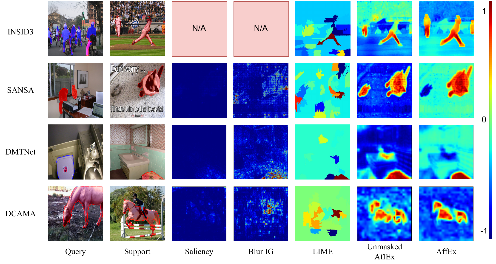

#  [AffinityExplainer](https://pasqualedem.github.io/AffinityExplainer/)

<div align="center">

---


This repository accompanies our paper, accepted at **NeurIPS 2026**:

> **Matching-Based Few-Shot Semantic Segmentation Models Are Interpretable by Design**

## Overview

Matching-based few-shot segmentation models compare support and query features to decide
what to segment. **AffinityExplainer (AffEx)** reads those matching scores and turns them
into an attribution over the support pixels: which parts of which example drove the
prediction. It needs no gradients, no perturbations and no training, and it applies to any
model that exposes its matching stage.



One 1-shot episode per model, with AffEx next to the baselines. The prediction is drawn in
red on the query, the ground truth in blue where it differs. Saliency and Blur IG do not
apply to INSID3, which is training-free.

### In this repository

- **AffEx** and its unmasked variant, plus every baseline the paper compares against
  (Saliency, Integrated Gradients, Guided IG, Blur IG, XRAI, DeepLift, LIME, and the
  Random and Gaussian Noise Mask controls).
- **Six models** behind one interface: DCAMA, DMTNet, INSID3, SANSA, GF-SAM, Matcher, and
  a PANet-style prototype head.
- **Causal evaluation**: insertion and deletion curves over the support set, with the
  early-regime read-outs mIoULoss@$p$ and IAUC_Conf@$p$.
- **An interactive demo** to look at attributions episode by episode.
- **Full reproducibility**: one parameter file per experiment, the episode lists committed
  with them, and datasets and weights downloaded on first use. Setup is `uv sync`.

---

## One-line demo

```bash
uvx --from git+https://github.com/pasqualedem/AffinityExplainer app
```

Only [uv](https://docs.astral.sh/uv/) is needed. Nothing else is installed by hand: the
demo downloads the model weights it needs the first time you pick a model, and COCO
episodes stream their images on demand, so trying AffEx on COCO costs one 108 MB model
download and nothing else. Pascal is a 2 GB archive, so the demo asks before fetching it.

What it is good for:

- **See what the model matched on.** Every support image gets an attribution map, so you
  can tell which shot carried the prediction and which one contributed nothing.
- **Ask about one region.** Draw on the query, on a single object or a part of one, and
  get the support evidence for that region alone. Asking about a false positive and about
  the correct object usually returns different support pixels, which is what makes a
  failure readable.
- **Test the explanation.** Replace a support mask with your own, rerun, and see whether
  the prediction moves the way the attribution said it would.
- **Compare methods on the same episode.** AffEx against Saliency, Blur IG, XRAI, LIME and
  the mask baselines, with the causal metrics computed on the spot.
- **Compare models on the same episode.** The same query and supports through DCAMA,
  DMTNet, INSID3, SANSA and GF-SAM shows how differently each matching mechanism resolves
  the support set, from coarse ResNet blobs to DINOv3 correspondences that follow object
  contours.

From a clone, the same thing:

```bash
uv run streamlit run affex/app.py
```

---

## Installation

```bash
git clone https://github.com/pasqualedem/AffinityExplainer.git
cd AffinityExplainer
uv sync
```

That is the whole setup. Datasets and checkpoints are fetched the first time something
asks for them, into `data/` and `checkpoints/`, and never again.

| Variable                | Effect                                                                           |
| ----------------------- | -------------------------------------------------------------------------------- |
| `AFFEX_DATA_DIR`      | where datasets live (default`data/`)                                           |
| `AFFEX_CHECKPOINTS`   | where weights live (default`checkpoints/`)                                     |
| `AFFEX_CACHE_DIR`     | where model outputs and attributions are cached between runs (default`cache/`) |
| `AFFEX_NO_DOWNLOAD=1` | a missing asset raises instead of downloading, for compute nodes with no network |
| `AFFEX_DEBUG=1`       | start the demo with the advanced controls visible                                |

Two checkpoints cannot be downloaded for you because they are licence-gated: the DINOv3
weights used by INSID3 and the SANSA adapter. If you ask for those models, the error names
the page to accept and the directory to drop the file into.

---

## Models

| Model      | Matching stage                              | Input |
| ---------- | ------------------------------------------- | ----- |
| DCAMA      | dense cross-attention                       | 384   |
| DMTNet     | multi-level feature correlation             | 400   |
| INSID3     | DINOv3 dense correspondence (training-free) | 1024  |
| SANSA      | dense SAM2 features                         | 1024  |
| GF-SAM     | DINOv2 correspondence, SAM decoder          | 1024  |
| Matcher    | DINOv2 correspondence, SAM decoder          | 518   |
| PANet head | prototype similarity on DCAMA's encoder     | 384   |

The upstream code for GF-SAM, Matcher and SANSA is vendored under `affex/models/`, each
with its own licence file, so nothing outside this repository has to be cloned.

---

## Reproduce the paper

Every experiment is a parameter file under `parameters/`, grouped by model:

```bash
# Table 1, mIoULoss@p for a model and dataset
uv run python main.py grid --parameters parameters/sansa/pascal_N1K5_aff.yaml

# Table 5, insertion and deletion curves
uv run python main.py grid --parameters parameters/sansa/insertion_deletion/pascal_N1K5_iaucdauc_1000.yaml

# computational cost
uv run python main.py grid --parameters parameters/computational/vfm_N1K5.yaml --function computational
```

`parameters/<model>/` holds the main runs, with `insertion_deletion/` and `gradients/`
underneath for the curves and the gradient baselines; `parameters/pascal/` and
`parameters/coco/` hold the runs that sweep several models at once, `parameters/ablation/`
the studies in the appendix, and `parameters/computational/` the cost measurements.
`scripts/experiments.sh` runs the lot in table order. Runs land in
`out/<timestamp>_<grid name>/`, one directory per configuration, with the per-episode
scores as csv.

Episodes come from the fixed lists in `data_csv/`, so every model sees the same support
and query images. `scripts/generate_data_csv.sh` rebuilds them, which draws different
episodes and invalidates comparison with the paper.

To split a long grid across jobs, set `dataloader.num_processes` in the parameter file and
submit each chunk; the chunks write to `p_000`, `p_001`, and so on, and are averaged
together afterwards. Passing `--parallel` submits them for you, through a scheduler script
you supply with `--scheduler_script` or `AFFEX_SCHEDULER_SCRIPT`, since queue names and
account strings differ from one cluster to the next.

---

## Repository map

```
main.py          run one configuration or a whole grid
affex/
  models/        one builder per model, upstream code vendored where possible
  explainer/     AffEx and every baseline, behind one interface
  data/          COCO-20i and Pascal-5i episodes
  metrics.py     insertion and deletion over the support set
  assets.py      what to download, and from where
  app.py         the demo
parameters/      one file per experiment
data_csv/        the episode lists the paper's numbers are computed on
scripts/         the experiment drivers, the appendix experiments and a model-output check
```

---

## Citation

```bibtex
@misc{marinisMatchingBasedFewShotSemantic2025,
	title = {Matching-{Based} {Few}-{Shot} {Semantic} {Segmentation} {Models} {Are} {Interpretable} by {Design}},
	url = {http://arxiv.org/abs/2511.18163},
	doi = {10.48550/arXiv.2511.18163},
	publisher = {arXiv},
	author = {Marinis, Pasquale De and Kaymak, Uzay and Brussee, Rogier and Vessio, Gennaro and Castellano, Giovanna},
	year = {2025},
}
```

---

## License

MIT, see [LICENSE](LICENSE). The vendored upstream code keeps its own licence, noted next
to it.

## Acknowledgments

We thank the authors of the few-shot segmentation models used here for publishing their
code and weights.
